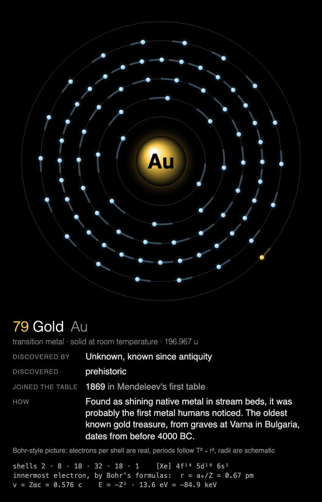
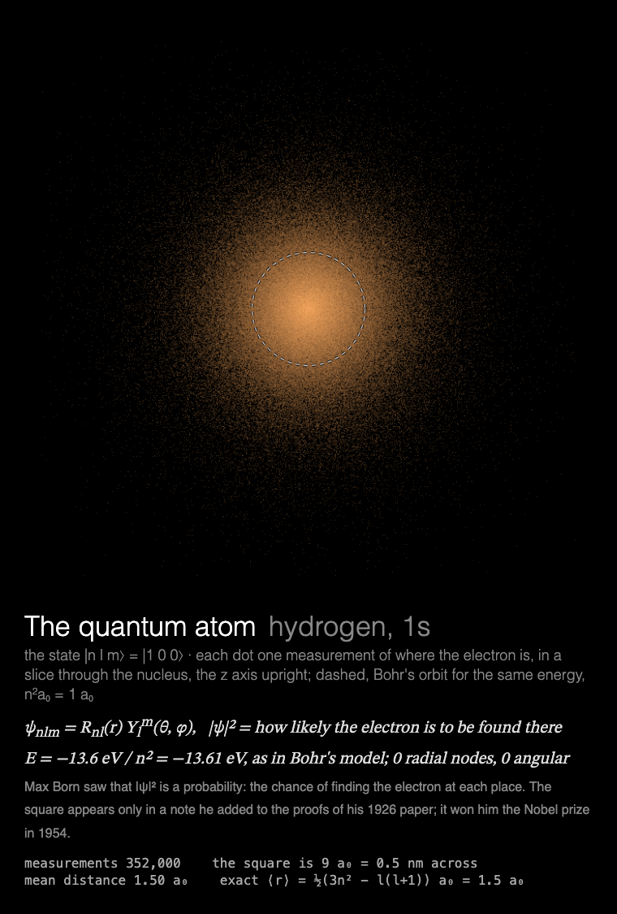

# MMM-Atom

A [MagicMirror²](https://magicmirror.builders/) module that draws an atom: a Bohr-style atom,
element by element, taking turns with hydrogen's quantum orbitals, measured dot by dot.





Two simulations, one per showing, taking turns: Bohr's picture of 1913, then Schrödinger's of 1926.

| key | what you see |
|---|---|
| `atom` | **A Bohr-style atom.** The element's electrons circle the nucleus in their shells, the outermost in the colour of the element's family. Underneath: who discovered it, when, how, and when it joined the periodic table. A different element each time, all 118 before any repeats. |
| `orbital` | **The quantum atom.** Hydrogen's electron in one of 30 states, shown the only way it can be seen: one measurement at a time, each dot a place it was found, with probability \|ψ\|². The picture develops like a long exposure, lobes coloured by ψ's sign, around Bohr's orbit for the same energy (dashed). Then it holds. |

Built for a **Raspberry Pi 3 without GPU acceleration**: everything is drawn by the CPU, so the
drawing is designed around what that costs (see [Performance](#performance)), and the animation
stops completely while the module is hidden.

## Installation

```bash
cd ~/MagicMirror/modules
git clone https://github.com/charleswest775/MMM-Atom
```

No npm dependencies, so no `npm install`.

## Update

```bash
cd ~/MagicMirror/modules/MMM-Atom
git pull
```

## Configuration

```js
{
	module: "MMM-Atom",
	position: "middle_center",
	config: {
		simulations: ["atom", "orbital"],
		width: 700,
		height: 700,
		fps: 12
	}
},
```

| Option | Default | Description |
|---|---|---|
| `simulations` | `["atom", "orbital"]` | Which to show, in turn, one per showing. `["atom"]` or `["orbital"]` for only one |
| `cycleSeconds` | `600` | Move to the next one this often while shown; it also moves on each time the module is shown again |
| `width`, `height` | `700` | Canvas size in pixels |
| `fps` | `12` | Frame-rate cap. The electrons move slowly, so 12 is smooth; on a Pi 3, half the CPU of 20 |
| `showMath` | `true` | The caption under the canvas: the element's history or the state's equations, and live numbers |
| `turns` | `null` | Share a page with other modules, taking turns: `{ of: n, at: k }` (see [Taking turns](#taking-turns)) |
| `atomElements` | `[]` | `atom`: symbols to show, e.g. `["H", "Fe", "Au"]`. Empty = all 118 |
| `atomOrder` | `"shuffle"` | `atom`: `"sequence"` goes through them by atomic number |
| `orbitalSeconds` | `22` | `orbital`: the exposure; then it holds |
| `orbitalRate` | `16000` | `orbital`: measurements per second |
| `statsPanel` | `false` | A line under the caption showing what the mirror spends: fps, CPU of Electron and the compositor, a bar per core, temperature, and the simulation cycle. Sampled by the module's `node_helper` from `/proc`, only while the module is shown |
| `debugStats` | `false` | Show achieved fps and per-frame timings in the corner of the screen |

## Taking turns

Modules on the same [MMM-pages](https://github.com/edward-shen/MMM-pages) page can take turns
with `turns: { of: n, at: k }`: they count the page's showings together, and each shows on its
own one in n, from showing k. A module whose turn it isn't takes no room on the page and costs
nothing. So one slot in the rotation can hold several pages, and the rotation stays short. The
atom and the Chladni figures, say, both standing waves:

```js
{
	module: "MMM-Atom",
	classes: "page-waves",
	position: "middle_center",
	config: { turns: { of: 2, at: 0 } }
},
{
	module: "MMM-Chladni",
	classes: "page-waves",
	position: "middle_center",
	config: { turns: { of: 2, at: 1 } }
},
```

with `modules: [["page-waves"], /* other pages */]` in MMM-pages' config. The atom then shows
every other time the page comes round, and within those showings `atom` and `orbital` take turns
in their own right.

Without `turns` the module works as well on a page of its own, or in a normal region without
MMM-pages: then it moves on every `cycleSeconds`.

## The Bohr atom

What's real in the picture: the electrons per shell, and the orbital periods, which follow
Kepler's third law T² ∝ r³ as circular orbits around a charge do (in Bohr's model r ∝ n² and
T ∝ n³, the same law). The radii are schematic, evenly spaced: true Bohr radii grow as n², and a
heavy atom's inner shells are a hundred times smaller than its outer ones. The numbers under the
history are Bohr's formulas for the innermost electron, which sees nearly the full nuclear
charge: r = a₀/Z, v = Zαc, E = −Z²·13.6 eV (gold's moves at 0.58 c).

"Joined the table" is 1869 for the 62 elements in Mendeleev's first table (which also had
didymium, later split into Pr and Nd, and lacked terbium, then in doubt); for later discoveries
the year the element was placed; from element 104 on, the year IUPAC fixed the name.

The element data, `data/elements.js`, is generated by `tools/build-elements.js` (see
[License](#license) for its sources). The histories, `data/element-history.js`, are written by
hand: corrections welcome.

The idea is from [MMM-AtomVisualizer](https://github.com/KristjanESPERANTO/MMM-AtomVisualizer),
which animates DOM nodes with CSS at the display's refresh rate. This one draws on a canvas, so
the frame cap applies and the animation stops while the module is hidden.

## The quantum atom

Each showing takes hydrogen's electron in one of 30 states |n l m⟩, from 1s to 6h, and plots
where it is found, one measurement at a time: ~350,000 dots in 22 s, each drawn at random with
probability |ψ|² (Born's rule) in a thin slice through the nucleus, the plane containing the z
axis, so the lobes, nodal planes and cones, and the radial nodes (n − l − 1 of them) show. Four
of them are circular states (m = l = n − 1), seen from above in the plane they circle in: a ring
whose most likely distance from the nucleus is exactly the radius of Bohr's orbit, n²a₀. Dashed
on every picture is Bohr's orbit for the same n; the energies, −13.6 eV/n², are the same in both
theories. Dots are warm where ψ is positive and cool where it's negative (on a ring, ψ's real
part, whose phase winds m times round). The readout samples distances from the radial
distribution r²R², so their mean can be watched converging on ⟨r⟩ = ½(3n² − l(l+1)) a₀.

The wavefunctions are exact: ψ = R_nl(r) Y_l^m(θ, φ) from the associated Laguerre and Legendre
functions. All 30 states are shown before any repeats.

## Performance

Measured on a Raspberry Pi 3 B+ (Electron 42, software rendering), as CPU of the Electron
processes plus the `cage` compositor, in % of one core (the Pi has four). Baseline mirror
without the module: 0.2%.

| | % of one core | achieved fps |
|---|---|---|
| module **hidden** (e.g. another MMM-pages page) | **0.3** | 0 |
| `atom`, 700×700 at 12 fps, elements with four shells or more (~33 for lighter ones, drawn smaller) | 78 | 12 |
| `atom`, 700×700 at 20 fps | 150 | 20 |
| `orbital`, 700×700 at 12 fps, over a 30 s showing, page change included (~125 for the first 3 s; ~45 while the picture develops, exposed by ~25 s, then ~4) | 47 | 12 |

Every electron moves, so `atom` redraws the whole atom each frame, and its cost is fps × area:
hence the smaller canvas and 12 fps, with orbits slow enough to look smooth at that rate. At
20 fps the Pi's renderer is saturated. `orbital` counts its dots per cell of a 640 × 640 grid and
turns them into colour four times a second, not every frame (~70% of the canvas each time);
after the exposure it rests.

What costs what on the Pi:

- Any frame that changes the canvas costs ~2% of a core per fps, before drawing anything.
- On top of that, cost grows with the **area that changes**: Chromium redraws the bounding box
  of everything touched in a frame.
- JavaScript is not the bottleneck: step and draw take a few milliseconds per frame at most.
- The frame loop sleeps with `setTimeout` until a frame is due. A simulation showing a finished
  picture rests, and is only polled twice a second. While MagicMirror fades the module out,
  nothing new is drawn, and once it's hidden the loop stops.

## Development

```bash
node --test                  # the physics checks, no dependencies
python3 -m http.server       # in the module folder, then open http://localhost:8000/dev/preview.html
node tools/build-elements.js elements.json  # rebuild data/elements.js from MMM-AtomVisualizer's data/elements.json
```

`dev/preview.html` runs the module outside MagicMirror², in a portrait 1200×1920 frame, with
hide/show buttons that follow MagicMirror's suspend/resume order. Query options override the
config, e.g. `?simulations=atom&atomElements=Au,Tc` or `?simulations=orbital&fps=20`.

The tests check the physics against known results rather than looks. For the atom: every
element's shells hold Z electrons, the periods obey T² ∝ r³, Bohr's formulas for hydrogen and
gold, and every element has its history, joining the table no earlier than it was discovered.
For the quantum atom: the special functions, the radial functions' normalisation, nodes and
orthogonality, ⟨r⟩, the circular states' radius, nodal planes and cones, and Born's rule in the
sampling.

## License

MIT. The element data in `data/elements.js` comes from
[MMM-AtomVisualizer](https://github.com/KristjanESPERANTO/MMM-AtomVisualizer) (MIT), and
originally from [Periodic-Table-JSON](https://github.com/Bowserinator/Periodic-Table-JSON)
(CC BY-SA 3.0).

Part of a family: [MMM-ChaosTheory](https://github.com/charleswest775/MMM-ChaosTheory),
[MMM-FractalZoom](https://github.com/charleswest775/MMM-FractalZoom),
[MMM-Chladni](https://github.com/charleswest775/MMM-Chladni),
[MMM-SacredGeometry](https://github.com/charleswest775/MMM-SacredGeometry),
[MMM-Tilings](https://github.com/charleswest775/MMM-Tilings),
[MMM-PlanetsDance](https://github.com/charleswest775/MMM-PlanetsDance),
[MMM-SnowCrystal](https://github.com/charleswest775/MMM-SnowCrystal),
[MMM-NightSky](https://github.com/charleswest775/MMM-NightSky) and
[MMM-PhotoDeck](https://github.com/charleswest775/MMM-PhotoDeck).
